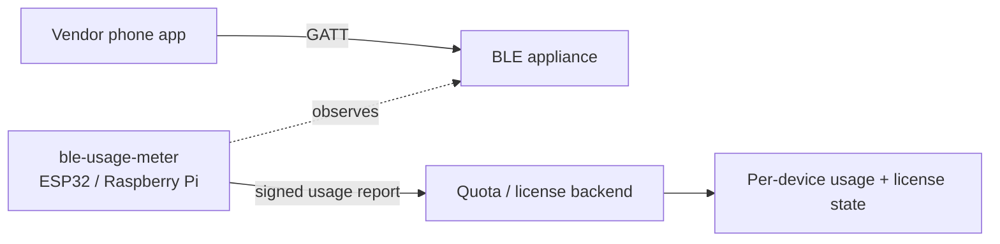

# ble-usage-meter

An independent usage meter for BLE appliances that are driven by a phone app.

Many Bluetooth appliances (printers, dispensers, lab and beauty devices) are controlled
from a vendor Android/iOS app and expose **no usage counter of their own**, or keep it
locked inside a vendor cloud. If you own a fleet of these devices and need to meter,
bill, or license their use, you have no trustworthy number to work from.

`ble-usage-meter` solves that by watching the BLE link itself. It recognises the specific
command that corresponds to one unit of work (a print, a dispense, a cycle), counts those
events per device, and posts a **signed, tamper-evident** usage report to a small backend.
The count is derived from what the device actually does, not from a vendor figure, and it
keeps working whether or not the vendor cooperates.

> Scope note: this is for **hardware you own**. It is an interoperability and metering tool,
> not a way to bypass a vendor's paywall or unlock paid features. The meter only observes and
> counts work your own device already performs; it never sends a command to an appliance.

---

## How it works

1. **Observe.** A small gateway (ESP32 with NimBLE, or a Raspberry Pi on BlueZ) watches the
   GATT traffic between the vendor app and the appliance. Passive sniffing is used where the
   link allows it; a transparent central-plus-peripheral **proxy** is the fallback when the
   connection is encrypted or uses connection parameters that defeat passive capture.
2. **Match.** A config entry maps `(service UUID, characteristic UUID, optional opcode/payload
   prefix)` to a named event, for example `work_unit`. Every match increments a counter.
3. **Persist.** Each device keeps a **monotonic** counter plus an append-only event log
   (timestamp, device id, event, sequence number) in flash or SQLite.
4. **Attest.** The gateway holds an Ed25519 key. Every usage report is signed and carries the
   monotonic sequence, so the backend can reject forged, replayed, or rolled-back counts.
5. **Enforce.** The optional backend verifies the signature and sequence, stores per-device
   usage, and applies a licence policy: activation, N units per period, or an expiry date.

---

## Why meter the event, not the vendor counter

The reliable signal is the **command to act**. Whatever the transport, when the app tells the
appliance to do one unit of work, that is an observable, countable event. Building the meter
around that fact means:

- it does not depend on the vendor exposing or sharing a counter;
- the same approach ports across devices by changing only the event mapping;
- the count is anchored to real activity, which is exactly what a licensing system needs.

---

## Protocol discovery (documented and repeatable)

The one thing that cannot be promised before looking at a specific device is the exact event
signature. The repo documents the method used to find it, so the discovery step is short and
predictable rather than guesswork:

- Enable the Android **HCI Bluetooth snoop log**, drive a few real work cycles, and open the
  capture in Wireshark to isolate the GATT writes that track the action.
- Cross-check by decompiling the vendor app (jadx) to map characteristic UUIDs to functions.
- If the link uses LE Secure Connections, document the two supported paths: capture the
  pairing for passive decryption, or run the meter as a re-pairing proxy.

`tools/parse_snoop.py` reads a snoop log you captured from your own phone and lists candidate
GATT writes by frequency, so the write that tracks your action stands out. It reads a file;
it does not talk to any device.

---

## Hardware

| Target | Stack | Notes |
|---|---|---|
| ESP32 | Arduino / ESP-IDF + NimBLE | Primary target, low cost, runs standalone per machine |
| Raspberry Pi | Python + BlueZ (`bluetoothctl`, `btmon`, D-Bus) | Easier proxy/MITM, richer logging, good for the bench |

---

## Trust model

The count has to survive the device holder wanting a smaller bill, so:

- the per-device counter is **monotonic** and never decreases, in flash or SQLite;
- the event log is **append-only**, with no update or delete path in the code;
- every report is **Ed25519-signed** over a canonical byte serialisation, so field order
  cannot change the signature;
- every report carries a **monotonic sequence**, and the backend rejects any report whose
  sequence is at or below the last one it accepted, which is what makes a replayed or
  rolled-back count fail rather than overwrite;
- the backend **denies by default** when a policy cannot be evaluated.

The private key stays on the gateway and is never committed. `tools/keygen.py` warns if you
try to write one inside the working tree.

---

## Design targets

What the meter is built to achieve, and what bring-up will measure against. These are the
specified targets, not results from a run: the hardware-specific rows can only be settled by
running against a real peripheral, and the `Status` list below tracks that.

| Metric | Target |
|---|---|
| Test peripheral | Any GATT peripheral the operator owns; no vendor-specific dependency |
| Transport observed | BLE 4.2 / 5.x GATT writes, passive where the link allows |
| Event signature | Operator-supplied `(service UUID, char UUID, payload prefix)` from `config/events.yaml` |
| Capture method | Passive sniff first; proxy fallback when the link is encrypted |
| Counted vs actual | Exact match, zero tolerance. A miscount is a bug, not drift |
| Counter behaviour | Monotonic, never decreases, survives reboot from NVS or SQLite |
| Drift over a soak | None by construction: the count is event-driven, not time-derived |
| Report signature | Ed25519 over a canonical byte serialisation, identical on firmware and gateway |
| Replay / rollback | Rejected: sequence must exceed the last accepted, count must not regress |
| Quota enforcement | Deny by default whenever a policy cannot be evaluated |
| Delivery | At-least-once, counter is the source of truth so a failed post never double-counts |

---

## Status

- [ ] ESP32 passive observer with configurable event mapping
- [ ] Proxy fallback for encrypted links
- [ ] Monotonic per-device counter with append-only log
- [ ] Ed25519-signed usage reports
- [ ] Minimal quota/license backend with verification
- [ ] Bring-up against a real peripheral, measured against the targets above

---

## Security notes

- Runs against hardware the operator owns; no vendor-cloud credentials are used or stored.
- Counts are monotonic and signed, so a device holder cannot quietly lower their own usage.
- The backend trusts a report only after signature and sequence checks pass.
- No commercial product is named or targeted anywhere in this repo. Event signatures are
  configuration you supply for your own hardware.

## Licence

MIT.
